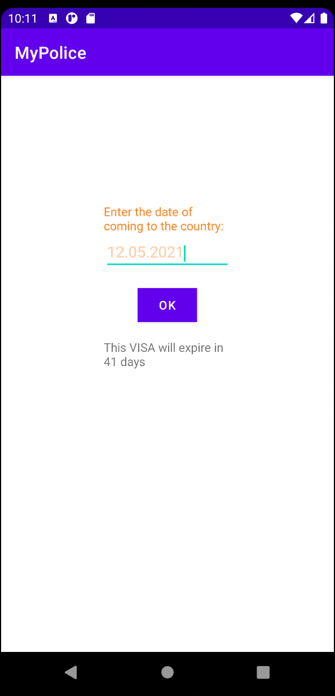
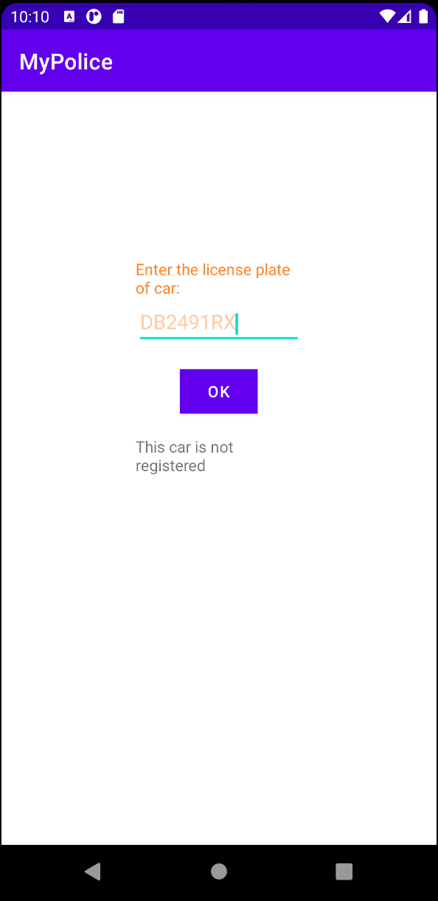
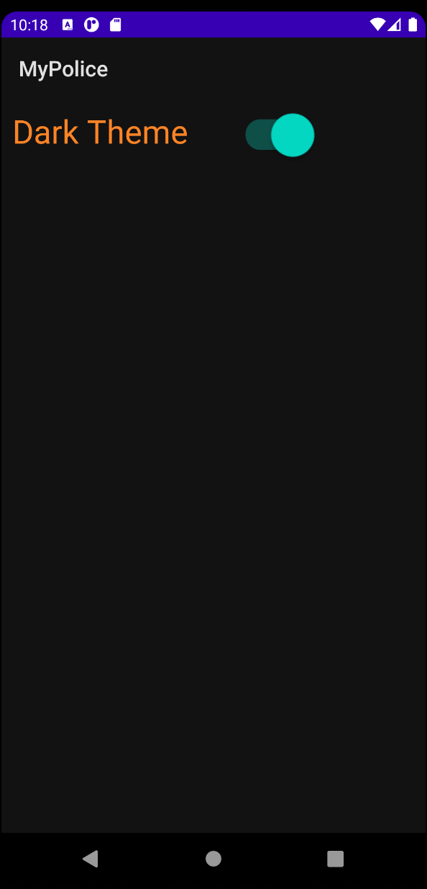
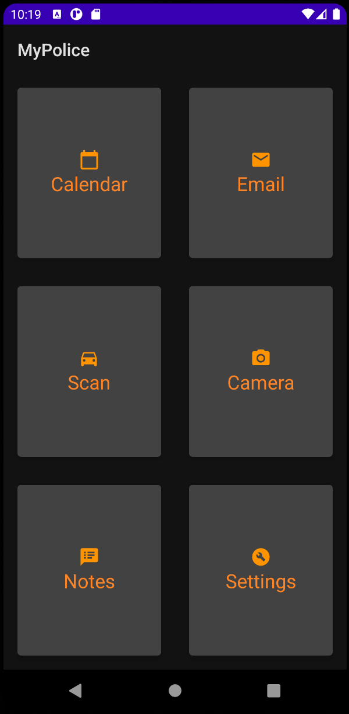

MyPolice
=======

This application is made for police officers

On the home screen, the police officer can select the built-in apps.

In the "CALENDAR" tab, a police officer can check whether a person is currently legally in the EU.

Vehicle license plate SCANNER detects whether the entered vehicle license plate is registered.

In the "NOTES" tab, the police officer can leave notes.

In the "EMAIL" tab, the police officer can send the message in police office.

The CAMERA allows you to take pictures and save them to the police station database.

In the SETTINGS the police officer can set the dark theme of the application for convenient use of the application at night.

